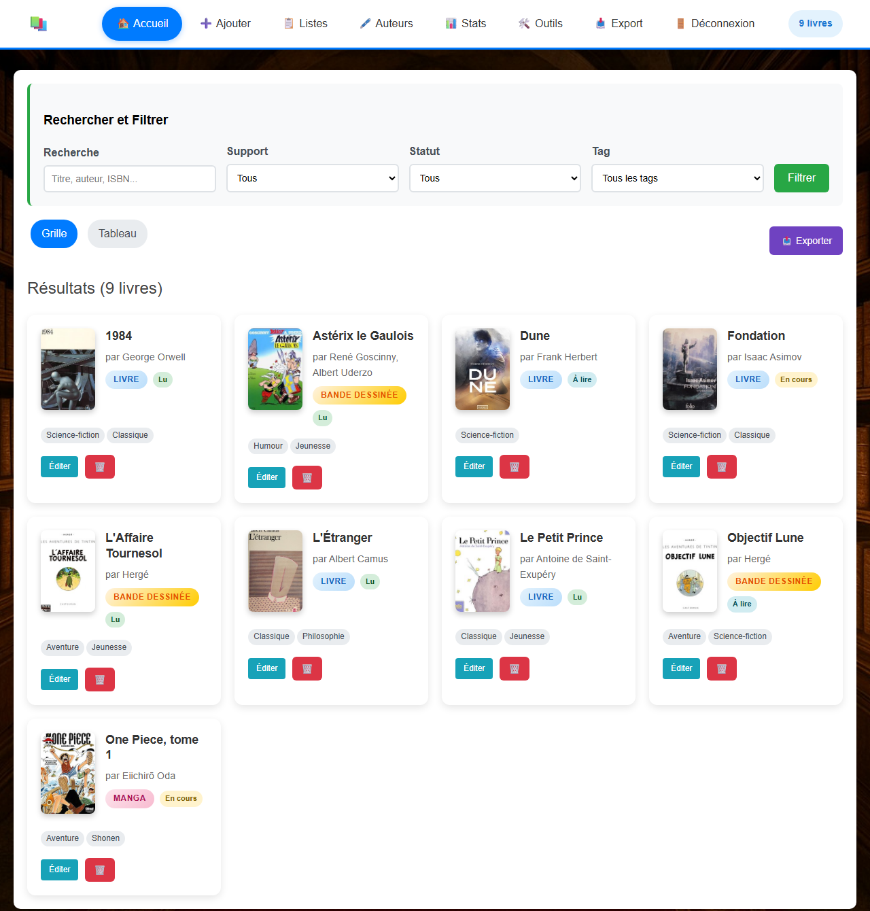
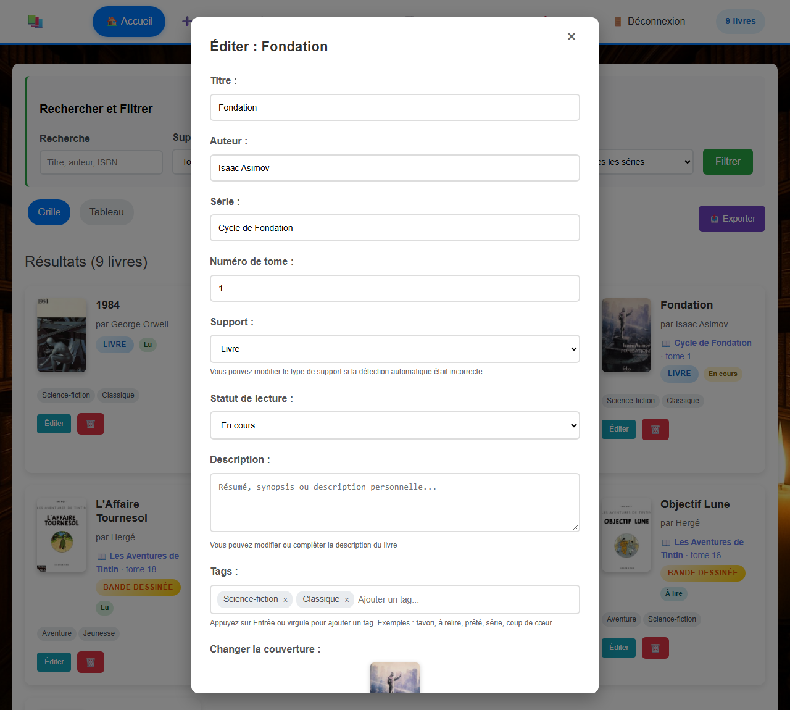
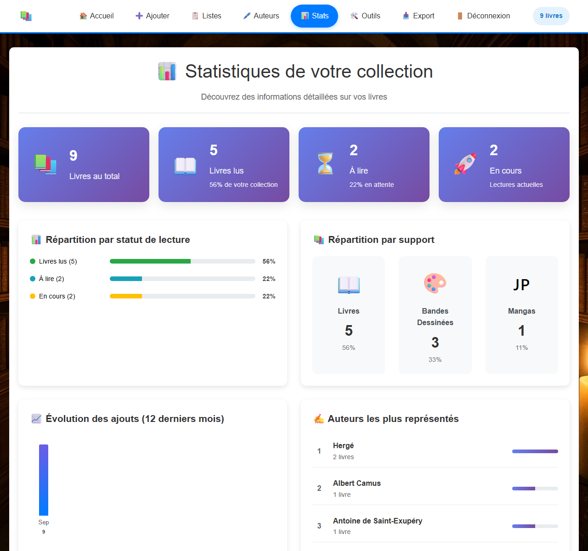
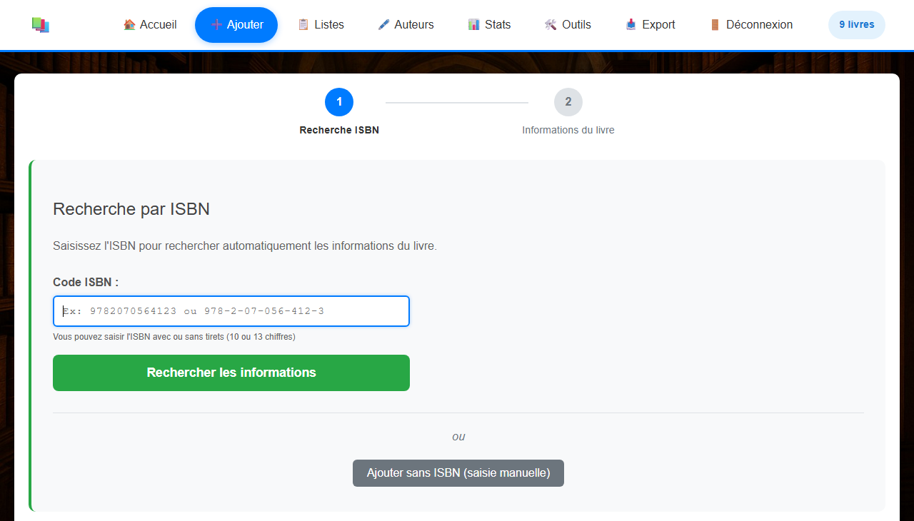
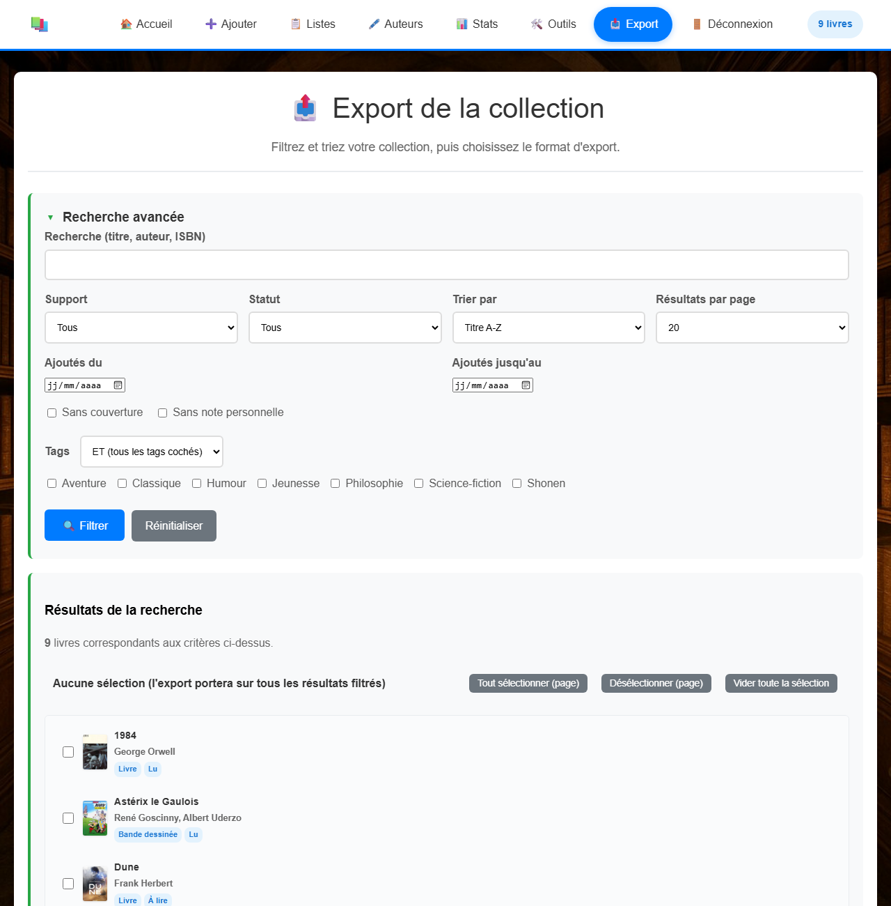

# 📚 Ma Collection de Livres

Application web personnelle pour gérer sa collection de livres, bandes dessinées et mangas. PHP + MySQL, sans framework, sans étape de compilation, entièrement en français.

## Fonctionnalités

- **Ajout par ISBN** : récupération automatique du titre, de l'auteur, de la description et de la couverture via Google Books, avec repli sur Open Library puis sur la BnF
- **Ajout manuel** et envoi de couvertures personnalisées
- **Listes de lecture** réordonnables par glisser-déposer
- **Fiches auteurs** avec biographie issue de Wikipédia, détection et fusion des doublons
- **Séries et tomes** : rattachez un livre à une série (« Cycle de Fondation », « One Piece »…) avec son numéro de tome, puis filtrez et triez par série
- **Tags**, **statuts de lecture** (À lire, En cours, Lu, Abandonné), notes personnelles
- **Statistiques** détaillées de la collection
- **Recherche avancée** (texte, support, statut, tags ET/OU, dates, sans couverture…)
- **Export** de toute la collection ou d'une liste : CSV, Excel, JSON, TXT, HTML
- **Outils** : édition en masse, gestion des types de supports et du catalogue de tags

## Aperçu

Les livres affichés ci-dessous sont des exemples.

**Ma collection** : recherche, filtres par support, statut, tag et série, affichage en grille ou en tableau.



**Édition d'un livre**, avec sa série et son numéro de tome :



**Listes de lecture** et **statistiques** :




**Ajout par ISBN** et **export avec recherche avancée** :





**Assistant d'installation** :


## Prérequis

- PHP **8.0 ou supérieur** avec les extensions `pdo_mysql`, `fileinfo`, `mbstring`, `json` (et de préférence `curl` et `simplexml`)
- MySQL ou MariaDB
- Un serveur web (Apache recommandé ; Nginx fonctionne mais les fichiers `.htaccess` ne sont pas lus, voir *Sécurité*)

## Installation

1. **Envoyez les fichiers** du projet dans le dossier web de votre serveur (ou clonez le dépôt).
2. **Créez une base de données** MySQL vide (facultatif : l'assistant tente de la créer si votre utilisateur en a le droit).
3. **Ouvrez le site** dans votre navigateur : vous êtes automatiquement redirigé vers l'assistant d'installation (`/install/`).
4. **Suivez les 4 étapes** :
   1. Présentation et vérification du serveur
   2. Adresse de la base de données, nom, identifiant et mot de passe MySQL
   3. Choix du mot de passe de connexion à l'application (+ clé Google Books facultative)
   4. Récapitulatif et installation
5. **Connectez-vous** avec le mot de passe choisi, puis **supprimez le dossier `install/`**.

L'assistant crée les tables, les dossiers `uploads/` et `logs/`, et écrit le fichier `config.php`. Pour réinstaller, supprimez `config.php`.

### Installation manuelle (sans assistant)

Copiez `config.example.php` en `config.php`, renseignez la base, générez le hash du mot de passe et le sel de session :

```bash
php -r "echo password_hash('VotreMotDePasse', PASSWORD_BCRYPT, ['cost' => 12]);"
php -r "echo bin2hex(random_bytes(32));"
```

Pour la base de données, deux possibilités :

- **Laisser l'application créer les tables** : elles sont créées (et mises à jour lors des évolutions) au premier chargement d'une page.
- **Les créer vous-même** avec le fichier [`schema.sql`](schema.sql), qui décrit tout le modèle de données :

  ```bash
  mysql -u UTILISATEUR -p NOM_DE_LA_BASE < schema.sql
  ```

  La base doit déjà exister. Le fichier est rejouable sans danger.

### Essayer en local

```bash
php -S localhost:8990 -t .
```

puis ouvrez <http://localhost:8990>.

## Clé API Google Books (facultative)

Sans clé, la recherche par ISBN partage un quota gratuit très limité. Pour en obtenir une : [console Google Cloud](https://console.cloud.google.com/) → créer un projet → activer « Books API » → Identifiants → Clé API. Renseignez-la à l'installation ou dans `config.php` (`google_books_api_key`).

## Sécurité

- `config.php` contient vos identifiants : il est ignoré par git et bloqué par `.htaccess`. Ne le publiez jamais.
- **Supprimez `install/`** après l'installation.
- Sous Nginx (ou si `.htaccess` est désactivé), interdisez l'accès web à `config.php`, `logs/` et l'exécution de PHP dans `uploads/`.
- Utilisez HTTPS. Les sessions expirent après 1 h d'inactivité, 5 échecs de connexion bloquent l'accès 5 minutes.
- Application conçue pour **un seul utilisateur** (un mot de passe unique).

## Documentation

- [Cas d'usage et besoins couverts](docs/cas-d-usage.md) : à quoi sert l'application, ce qu'elle fait et ce qu'elle ne fait pas
- [Évolutions envisagées](docs/evolutions.md) : ce qui est prévu, écarté, et pourquoi
- [Architecture](docs/architecture.md) : fonctionnement du code, à lire avant de le modifier
- [Modèle de données](schema.sql) : les tables de la base

## Structure du code

Le projet reste volontairement simple (pas de framework, pas de Composer), mais respecte une séparation vue/contrôleur : chaque page à la racine ne fait que du traitement (formulaires, upload, appels à `$bookManager`) et se termine par un `require` vers sa vue dans `views/`, qui ne contient que du HTML.

```
index.php, ajouter.php, listes.php, …   Contrôleurs : traitement des formulaires (POST), aucun HTML
views/                                  Vues : une par page, uniquement de l'affichage
includes/                               Démarrage (bootstrap), authentification, menu, fonctions utilitaires et d'export
BookManager.php                         Point d'entrée unique de la couche de données (façade)
src/                                    Classes qui contiennent le SQL, une par thème
install/                                Assistant d'installation (à supprimer après usage)
```

Chaque page charge `includes/bootstrap.php`, qui ouvre la session, vérifie la connexion et crée l'objet `$bookManager`. Les pages appellent ensuite `$bookManager->uneMethode()` sans jamais écrire de SQL, puis délèguent l'affichage à leur vue (`require 'views/nom_de_la_page.php';`). Certaines vues appellent directement `$bookManager` pour des données purement d'affichage (ex : liste des séries ou des supports pour un menu déroulant), sans jamais modifier l'état de l'application.

`BookManager` ne contient aucune logique : il crée une connexion PDO partagée et délègue chaque appel à la classe du dossier `src/` qui en est responsable :

| Classe | Responsabilité |
|---|---|
| `LivreRepository` | livres : ajout, modification, suppression, recherche simple et avancée, édition en masse, séries, pagination, couvertures |
| `ListeRepository` | listes de lecture et ordre des livres |
| `AuteurRepository` | biographies (Wikipédia / Wikidata), photos, regroupement par auteur, doublons et fusion |
| `TagRepository` | tags et catalogue de tags |
| `SupportRepository` | types de support (Livre, Bande dessinée, Manga…) |
| `IsbnLookup` | recherche par ISBN : Google Books, Open Library, BnF |
| `Stats` | statistiques de la collection |
| `Schema` | création et mise à jour automatiques des tables et des index |
| `Maintenance` | sauvegarde et restauration JSON, optimisation, diagnostic de la base et du dossier `uploads/` |

Pour ajouter une fonctionnalité qui touche la base : écrivez la méthode dans la classe de `src/` concernée, puis ajoutez une méthode d'une ligne dans `BookManager` qui l'appelle. Pour faire évoluer le schéma, complétez les migrations de `src/Schema.php` : elles sont rejouables et s'exécutent au chargement des pages, sans script de migration à lancer.

## Licence

[MIT](LICENSE)
